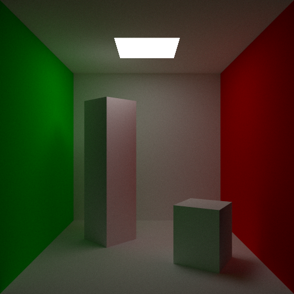
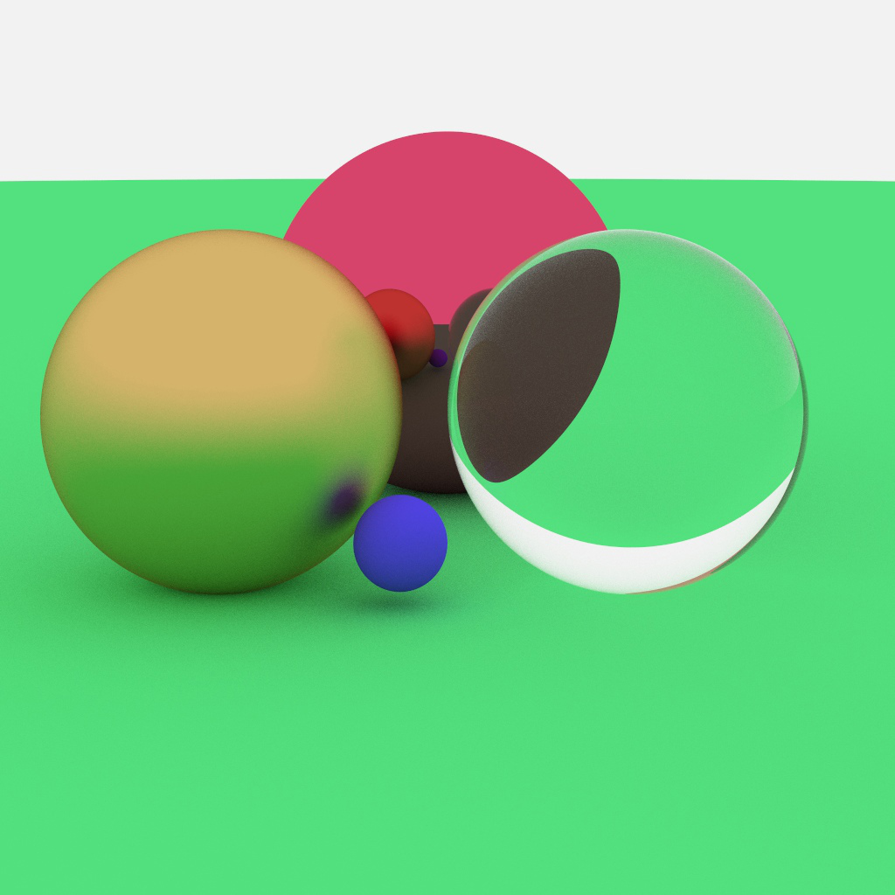
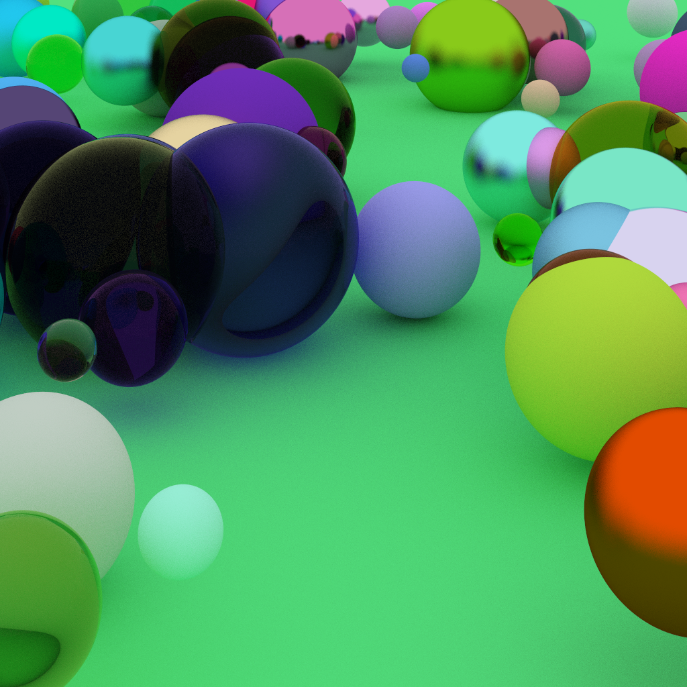
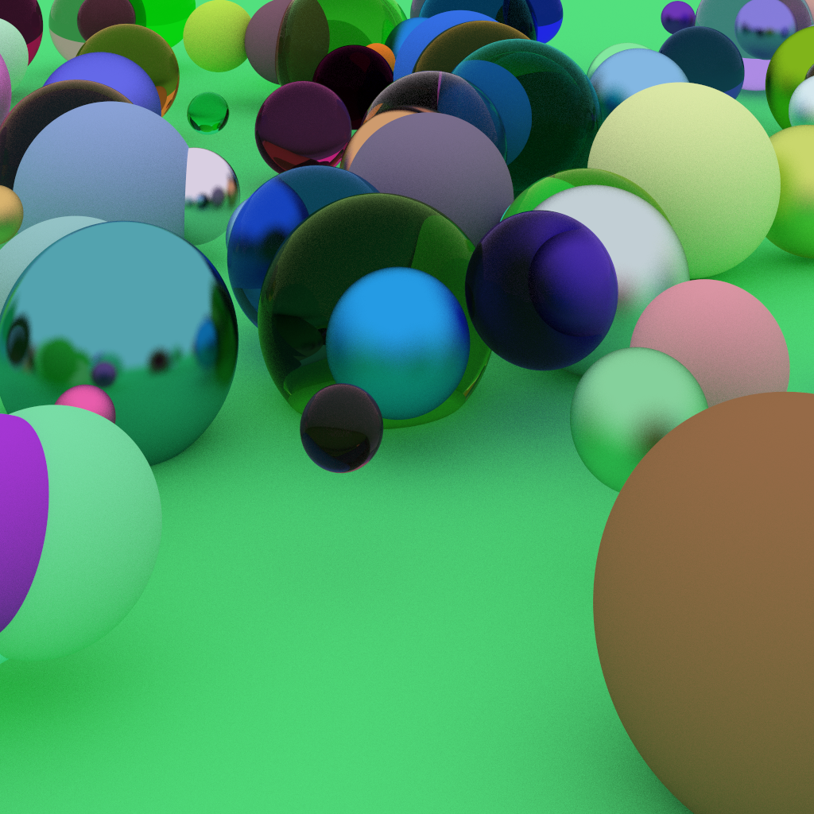
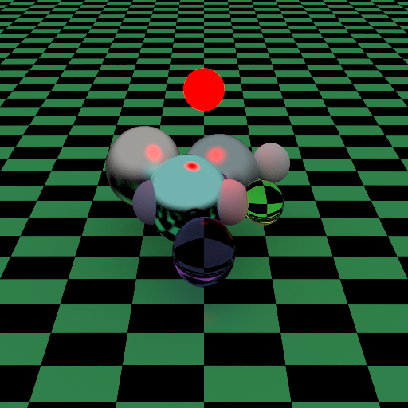

# path_tracing as it is




(check out more pictures below)

### How to use
0. Change settings and scenery in main.cpp
1. ```make``` to build
2. ```./pather``` to run
3. Look for output in 'image.ppm'

# Some results







## Links to check out:
https://github.com/Magorx/ray_marching
https://github.com/Magorx/cray_tracing
